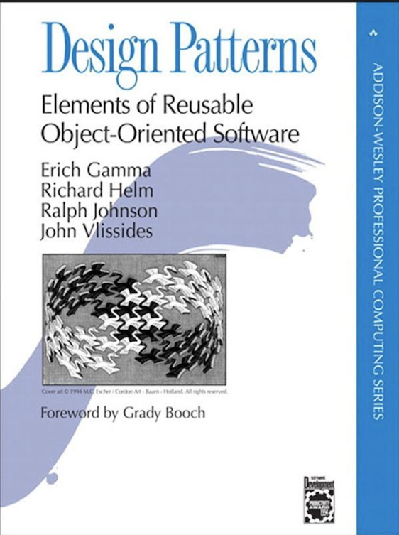
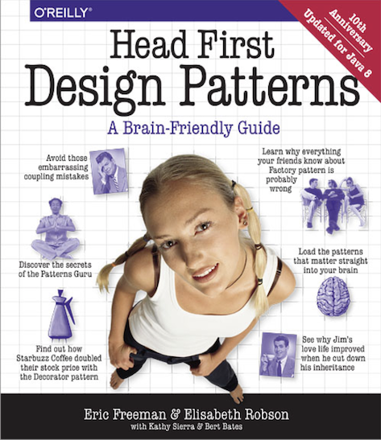

<!-- $theme: default -->

# Лекция 6

Паттерны проектирования
===

Данила Кутенин

---

# Что это?
* Типовые методы решения типовых задач
* Высокоуровневые идеи, помогающие организовать код
* Общеиспользуемые термины, с помощью которых можно описать систему

---

# NB: паттерн нельзя придумать, его можно обнаружить

---



---



---


# Template Method 

Абстрактное определение алгоритма, разбитое на шаги. Классы-потомки переопределяют конкретные шаги, при этом общая структура остается неизменнной.

---

```c++
class Animal {
public:
    void DoStuffInTheMorning() {
        GetUp();
        MakeSound();
        AskForFood();
        GoForAWalk();
    }
// ...
};
```
```c++
class Cat : public Animal {
public:
    virtual void MakeSound() override {
        Meow();
    }
};
```
```c++
class Dog : public Animal {
public:
    virtual void MakeSound() override {
        Bark();
    }
};
```
---

# Singleton

Класс, гарантирующий существование единственного своего представителя, и предоставляющий доступ к нему

(самый спорный паттерн)

---

# Глобальные переменные и разные единицы трансляции

x.h
```c++
#pragma once

int& GetX();
void IncX();
```

x.cpp
```c++
int x = 0;

int& GetX() {
    return x;
}

void IncX() {
    ++x;
}
```

---

main.cpp
```c++
#include "x.h"

#include <iostream>

int main() {
    auto& xRef = GetX();
    std::cout << xRef << std::endl;
    IncX();
    std::cout << xRef << std::endl;
}
```

```
0
1
```

---

# Вопрос: что будет, если объявить int x в x.h?

---

# Ответ: каждый файл, включающий x.h получит свою копию x и все сломается.

```
duplicate symbol _x in:
    main.cpp.o
    x.cpp.o
    ...
```

---

# Вопрос: можно ли объявить глобальную переменную в одном файле, а в другом обращаться к ней напрямую?

---

# Ответ: с помощью extern

```c++
extern int x;

int main() {
    std::cout << x << std::endl;
    IncX();
    std::cout << x << std::endl;
    ++x;
    std::cout << GetX() << std::endl;
}
```
```
0
1
2
```

---

# Вопрос: как запретить обращаться к глобальной переменной извне той единицы трансляции (cpp файла), в котором она находится?

---

# Ответ:

x.cpp
```c++
static int x;

...
```

```
Undefined symbols for architecture x86_64:
  "_x", referenced from:
      _main in main.cpp.o
```

---

logger.h
```c++
class Logger {
public:
    void log(const std::string& message) {
        ...
    }
}

Logger& GetLogger();
```

logger.cpp
```c++
static Logger logger;

Logger& GetLogger() {
    return logger;
}
```

---

# NB: Вызов конструктора Logger произойдет до захода в main(), даже если он ни разу не будет использован

---
logger.h
```c++
class Logger {
public:
    static Logger& GetInstance() {
    	if (!logger) {
            logger.reset(new Logger);
        }
        
        return *logger;
    }
    
private:
    Logger() {
    	// ...
    }
    
    static std::unique_ptr<Logger> logger;
}
```
logger.cpp
```c++
std::unique_ptr<Logger> Logger::logger;
```

---

# Спойлер: в многопоточной программе такая реализация сломается 

---

```c++
Logger& GetLogger() {
    static Logger logger;
    return logger;
}
```

---

```c++
void f() {
    static int x = 0;
    std::cout << ++x << std::endl;
}

int main() {
    f();
    f();
    f();
}
```
```
1
2
3
```

---

# NB: static гарантирует, что при многопоточном исполнении статическая локальная переменная будет инициализирована ровно один раз при первом вызове

---

# Четыре лица static

* Глобальная функция или переменная, объявленная как **static**, не видна снаружи единицы трансляции (cpp файла)
* Локальная **static** переменная одна на все вызовы этой функции 
* **static** метод у класса можно вызывать без объекта (MyClass::StaticMethod(args))
* **static** переменная внутри класса одна на все объекты

---

```c++
template<class T>
T& GetInstance() {
    static T instance;
    return instance;
}
```

---

# Command (Action, Transaction)

Действие и его совершение инкапсулируются в объекте, тем самым позволяя это действие передавать, хранить и обращать.

---

```c++
class ICommand {
public:
    virtual void Do() = 0;
    virtual void Undo() = 0;
    
    virtual ~ICommand() = default;
};
```

---

```c++
class AppendCommand : public ICommand {
public:
    AppendCommand(Document& doc_,
                  const std::string& text_)
            : doc(doc_), text(text_) {
    }

    void Do() {
        doc.AppendText(text);
    }

    void Undo() {
        doc.PopBack(text.size());
    }

private:
    Document& doc;
    std::string text;
};
```

---

```c++
class Document {
    friend class AppendCommand;

public:
    void Append(const std::string& text) {
        AddCommand(
            std::make_unique<AppendCommand>(*this, text));
    }
	
    void Undo() {
    	if (commands.empty()) {
            return;
        }
        commands.back()->Undo();
        commands.pop_back();
    }

private:
    void AppendText(const std::string& text);
    void PopBack(size_t len);

    void AddCommand(std::unique_ptr<ICommand> command);
    std::vector<std::unique_ptr<ICommand>> commands;
};
```

---

# Factory Method

"Виртуальный конструктор", позволяет создавать объекты конкретного типа, возвращая их как указатель на базовый класс

---

```c++
class IFruit {
public:
    virtual ~IFruit() = default;
    virtual std::string GetDescription() = 0;
};

class Apple : public IFruit {
public:
    std::string GetDescription() override {
        return "Red crunchy apple";
    }
    // ...
};

class Orange : public IFruit {
public:
    std::string GetDescription() override {
        return "Mid sized juicy orange";
    }
    // ...
};
```

---

```c++
class Orchard {
public:
    std::unique_ptr<IFruit>
    ProduceFruit(const std::string& name) {
       if (name == "apple") {
           return std::make_unique<Apple>();
       }
       if (name == "orange") {
           return std::make_unique<Orange>();
       }

       return nullptr;
    }
};
```

---

```c++
auto fruit1 = orchard.ProduceFruit("apple");
std::cout << fruit1->GetDescription() << std::endl;

auto fruit2 = orchard.ProduceFruit("orange");
std::cout << fruit2->GetDescription() << std::endl;
```
#
```text
Red crunchy apple
Mid sized juicy orange
```

---

# Что если мы хотим добавить возможность производить новые фрукты, но при этом не трогать код сада?

---

# Abstract Factory

Предоставляет интерфейс для создания семейств объектов без знания их конкретного класса

---

```c++
class IFruitProducer {
public:
    virtual ~IFruitProducer() = default;
    virtual std::unique_ptr<IFruit> Produce() = 0;
};

class AppleProducer : public IFruitProducer {
public:
    std::unique_ptr<IFruit> Produce() override {
        return std::make_unique<Apple>();
    }
};

class OrangeProducer : public IFruitProducer {
public:
    std::unique_ptr<IFruit> Produce() override {
        return std::make_unique<Orange>();
    }
};
```

---

# Вопрос: почему Produce - не статический метод?

---

# Ответ: сломается механизм виртуальных вызовов

---

```c++
class Orchard {
public:
    void RegisterProducer(const std::string& name, 
             std::unique_ptr<IFruitProducer> producer) {
        
        producers.insert({name, std::move(producer)});
    }

    std::unique_ptr<IFruit>
    ProduceFruit(const std::string& name) {
       auto it = producers.find(name);
       if (it != std::end(producers)) {
           return it->second->Produce();
       }

       return nullptr;
    }

private:
    std::unordered_map<
        std::string, 
        std::unique_ptr<IFruitProducer>
    > producers;
};
```

---

```c++
Orchard orchard;
orchard.RegisterProducer("apple", 
		std::make_unique<AppleProducer>());
orchard.RegisterProducer("orange", 
		std::make_unique<OrangeProducer>());

auto fruit1 = orchard.ProduceFruit("apple");
std::cout << fruit1->GetDescription() << std::endl;

auto fruit2 = orchard.ProduceFruit("orange");
std::cout << fruit2->GetDescription() << std::endl;
```
#
```text
Red crunchy apple
Mid sized juicy orange
```

---

```c++
class IFruit {
public:
    virtual ~IFruit() = default;
    virtual std::string GetDescription() = 0;
};

template <class TFruit>
class FruitProducer : public IFruitProducer {
    std::unique_ptr<IFruit> Produce() override {
        return std::make_unique<TFruit>();
    }
};
```
```c++
orchard.RegisterProducer("apple", 
              std::make_unique<FruitProducer<Apple>>());
```

---

```c++
orchard.RegisterProducer("int", 
              std::make_unique<FruitProducer<int>>());
```
#
```text
error: no viable conversion from returned value 
of type 'unique_ptr<int>' 
to function return type 'unique_ptr<IFruit>'
```

---

```c++
template <class TFruit>
class FruitProducer : public IFruitProducer {

    static_assert(std::is_base_of<IFruit, TFruit>(),
                  "TFruit must inherit from IFruit");

    std::unique_ptr<IFruit> Produce() override {
        return std::make_unique<TFruit>();
    }
};
```

---

```c++
Orchard orchard;

orchard.RegisterProducer("apple", []() {
    return std::make_unique<Apple>();
});

orchard.RegisterProducer("orange", []() {
    return std::make_unique<Orange>();
});
```

---

## Factory Method + Abstract Factory = ~~Love~~ Factory

---

# Слайды*

---

# Вопрос: что делать, если в синглтоне помимо GetInstance() мы хотим пользоваться методами InitInstance(), DestroyInstance(), ResetInstance()? 

---

# Ответ: использовать CRTP
## Curiously Recurring Template Pattern


---

```c++
template <class T>
class Singleton {
public:
    static T& GetInstance() {
        assert(instance);
        return *instance;
    }

    static void InitInstance() {
        assert(!instance);
        instance.reset(new T);
    }

    static void DestroyInstance() {
        assert(instance);
        instance.reset();
    }
    
    Singleton(const Singleton&) = delete;
    Singleton(Singleton&&) = delete;
    Singleton& operator = (const Singleton&) = delete;
    Singleton& operator = (Singleton&&) = delete;
```
   
---

```c++
template <class T>
class Singleton {

    // ...
    
protected:
    Singleton() = default;
    static std::unique_ptr<T> instance;
};

template <typename T>
std::unique_ptr<T> Singleton<T>::instance;
```
---

```c++
class Logger {
public:
    Logger() {
    	// ... 
    }
    
    void log(const std::string& message) {
    	// ...
    }
};
```

```c++
Singleton<Logger>::InitInstance();
Singleton<Logger>::GetInstance().log("I'm a singleton");
```

---

```c++
Singleton<Logger>::InitInstance();
Singleton<Logger>::GetInstance().log("I'm a singleton");
```
vs

```c++
Logger::InitInstance();
Logger::GetInstance().log("I'm a singleton");
```

---

```c++
class Logger : public Singleton<Logger> {
public:
    Logger() {
    	// ... 
    }
    
    void log(const std::string& message) {
    	// ...
    }
};
```

---

```c++
class Logger : public Singleton<Logger>
```


---

# Вопрос: можем ли мы создавать экземпляры Logger в обход GetInstance()?

---

# Ответ: можем, но перезаписать объект, возвращаемый GetInstance() все равно не получится

---

# Вопрос: что если конструктор Logger принимает аргументы? 
# Что если их несколько?
# Что если в разных классах их количество не совпадает?

---

# Ответ: variadic templates

```c++
template <typename... Args>
static void InitInstance(Args&&... args) {
    assert(!instance);
    instance.reset(new T(std::forward<Args>(args)...));
}
```

```c++
class Logger : public Singleton<Logger> {
public:
    Logger(const std::string& file) {
        // ...
    }
    
    // ...
```
```c++
Logger::InitInstance("log.txt");
Logger::GetInstance().log("I'm a singleton");
```