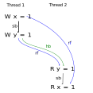
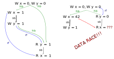
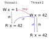
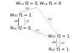
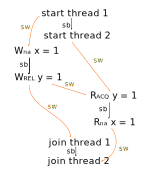
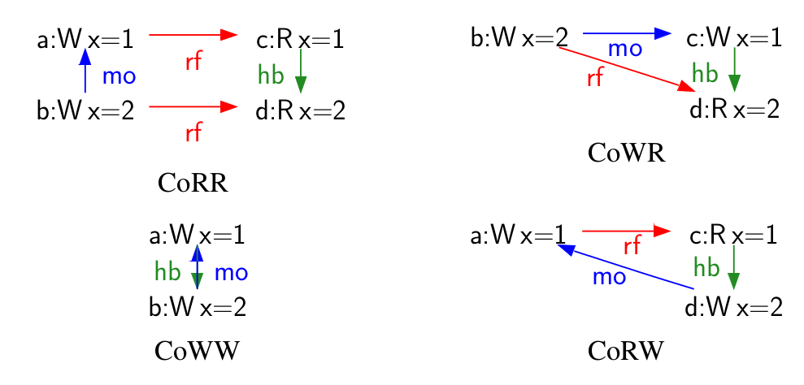
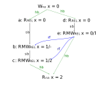
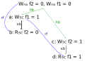

# Парадигмы мультипоточных вычислений

Данила Кутенин. Лекция 10

---

# Threads

* Вы создаёте треды (5 microseconds)
* Ядро хранит контекст -- состояние всех регистров и стека. Память хранится общая
* Ядро переключает треды за вас (3-100 microseconds). Общение с ядром
* Большие сервера ~ 1000-2000 тредов от силы
* Ядро может уйти в себя -- там КЧ дерево, иногда при балансировках спайки активностей :)

---

# Threads. Контроль ядра

* Каждый процесс получает долю процессорного времени.
* Когда поток создается в процессе, планировщик потоков назначает ему сегмент процессорного времени этого процесса; этот временной отрезок называется квантом. Планировщик потоков назначает квант, вычисляет приоритет потока и добавляет его в очередь выполнения.
* Планировщик потоков выбирает первый поток из очереди и запускает. Поток выполняется до тех пор, пока либо не израсходует свой квант, либо не будет заблокирован (например, мьютекс, I/O). Израсходовал свой квант -- в очередь. Если он блокируется -- удаляется из очереди, пока он не будет разблокирован.

---

# Threads

Блокирующие парадигмы страдают большим количеством точек синхронизации -- много уходит мыслей как их комбинировать, чтобы в больших программах оно работало быстро

```cpp
std::vector<std::thread> thrs(...);

for (auto&& thr : thrs) thr.join();

// 50 lines later

std::vector<std::thread> another_threads(...);

for (auto&& thr : another_threads) thr.join();
```

---

# Threads

Parallel algorithms. Представьте 25 мест:

```cpp
std::for_each(std::execution::par, std::begin(a), std::end(a), [&](int i) {
  //...
});
```

```cpp
std::sort(std::execution::par, std::begin(a), std::end(a), [&](int i) {
  //...
});
```

---

# Threads. Parallel algorithms

* Сколько тредов?
* Вдруг кто-то наплодит сотню тредов?
* А как я могу контролировать количество, хочу две программы на сервере?
* Embedded системы ничего не выигрывают тоже
* Что теперь, параллельность встроена в парадигму плюсов?
* Вы теперь должны думать о том, можно ли что-то распаралеллить в одной точке на уровне синтаксиса
* Кому это надо? Для задач на курсе по плюсам или Миши Густокашина?

---

# Threads. Как решать некоторые проблемы?

* Унифицировать откуда берутся потоки (Абсолютно все)
* Уменьшать оверхед ядра (например, Google)
  * Легче учить, сложнее сделать и контролировать
* Менять парадигму вычислений (Facebook, trading, Python, JavaScript ...)
  * Асинхронное программирование
    * Сложнее учить, легче сделать
  * Корутины
    * Ещё сложнее учить, легче сделать (в Go ~ легко учить)
  * Акторы, генераторы (накрутки или подмножества корутин)
    * Ещё сложнее учить

---

# Threads. Не очень решаемые проблемы: количество тредов

* В MapReduce технологии мы обрабатываем экзабайты данных (для простоты, считайте, что по x вычисляем f(x)). Если вы в Яндексе, подумайте про YT
* Это десятки-сотни тысяч/миллионы процессов по 8 тредов на разных машинах
* Почему вОсЕмЬ?
  * Мы убили уже год понять, почему это лучше или хуже
  * Вообще ни разу не поняли
  * Хотите стажировку?

---

# Threads. Количество тредов. Проблемы

* Было удобно паковать на датацентре
* Оптимально по памяти (если много, больше кеш миссов)
* Выиграть из fixed cost памяти и CPU -- увеличиваешь количество тредов, уменьшаешь количество памяти
* Не умереть по блокировкам, если они есть

Это филигранный анализ, нет ответа, сложно придумать алгоритм как вообще балансировать эти вещи

---

# Threads. Как решать?

* Это открытый вопрос, хороших ответов нет
* Хотите стажировку? (2)

---

# Threads. Простые правила для всех

* Вы используйте многопоточность, чтобы **утилизировать железо**
* Вы имеете **одну**, максимум пару точек, где вы аллоцируете треды
* Каждый **мьютекс уменьшает** вам ускорения от железа
  * Это не значит, что надо использовать lock-free алгоритмы
  * Считайте, что lock-free алгоритмы имплементируют простую версию мьютекса
    * В очереди под mutex вы умеете класть, вытастикать и ждать
    * В lock-free очереди вы кладёте, вытаскиваете или **повторяете**
* Зависит от того как вы параллелите данные, но в среднем 2-3 * #CPU тредов достаточно, чтобы утилизировать нормально #CPU -- в общем случае смотрите кто и сколько сидит на мьютексах

---

# Threads. Простые правила для всех

* Атомики быстрее, но требуют аккуратных доказательств
* Когда сомневаетесь, используйте мьютекс
* Асинхронность не всегда лучше, но обычно лучше для low latency, где много действий
  * Counter-Strike, gamedev
  * Trading
* Асинхронность бесполезна, если вы хотите большую пропускную способность
  * Обработка больших массивов данных
  * Поисковые запросы

---

# Thread pool

* Место аллокации тредов
* Можно с приоритетами, можно со вкусом
* Ничего интересного
  * Регистрируйте таски, они исполняются из очереди
* Должен быть один на всю программу, **прошу**

---

# Thread pool

```cpp

// Launch the pool with four threads.
boost::asio::thread_pool pool(4);

// Submit a lambda object to the pool.
boost::asio::post(pool,
    []()
    {
      ...
    });

// Wait for all tasks in the pool to complete.
pool.join();
```

---

# Thread pool. А если таски что-то возвращают?

* Уже почти асинхронное программирование
* `std::promise`, `std::future`

---

```cpp
void accumulate(std::vector<int>::iterator first,
                std::vector<int>::iterator last,
                std::promise<int> accumulate_promise) {
    int sum = std::accumulate(first, last, 0);
    accumulate_promise.set_value(sum);  // Notify future
}
int main() {
    // Demonstrate using promise<int> to transmit a result between threads.
    std::vector<int> numbers = { 1, 2, 3, 4, 5, 6 };
    std::promise<int> accumulate_promise;
    std::future<int> accumulate_future = accumulate_promise.get_future();
    std::thread work_thread(accumulate, numbers.begin(), numbers.end(),
                            std::move(accumulate_promise));
    // future::get() will wait until the future has a valid result and retrieves it.
    // Calling wait() before get() is not needed
    //accumulate_future.wait();  // wait for result
    std::cout << "result=" << accumulate_future.get() << '\n';
    work_thread.join();  // wait for thread completion
}
```

---

```cpp
std::array<char, 128> recv_buf;
udp::endpoint sender_endpoint;
std::future<std::size_t> recv_length =
      socket.async_receive_from(
          boost::asio::buffer(recv_buf),
          sender_endpoint,
          boost::asio::use_future);
```

---

# Асинхронное программирование. Плюсы

* Возвращение из функции сразу (отложенное реальное исполнение)
* Вы регистрируйте другие вещи пока ходите по этим callbacks
* Легко выдать ресурсы один раз, потом завязать всё исполнение на этом

---

# Асинхронное программирование. Минусы

* Протаскивание этих коллбеков до самой глубины
* Асинхронным коллбекам нужен стейт
* Удачи это дебагать :)

```cpp
std::string error = SomeComputation(...);
async_logger.write([&] { return error; }); // most likely wrong
```

---

# Cooperative vs preemptive

* Cooperative -- пользовательская библиотека решает когда и кто исполняется
* Preemptive -- ядро делает всю работу

---

# Корутины

* Треды в cooperative модели -- вы сами должны входить/уходить из корутины (co_yield, co_await, co_return)
* Иногда это делают за вас (как в языке Go)

```cpp
task<> tcp_echo_server() {
  char data[1024];
  while (true) {
    size_t n = co_await socket.async_read_some(buffer(data)); // wait
    co_await async_write(socket, buffer(data, n)); // wait
  }
}
```

---

```cpp
generator<int> iota(int n = 0) {
  while(true)
    co_yield n++; // Give another coroutine work
}
```

```cpp
lazy<std::string> f() {
  co_return "abc"; // finish the coroutine work
}
```

---

# Корутины

* Сейчас в С++ ещё никто не знает как нормально пользоваться корутинами
* Время покажет, мой совет в 2021 -- поиграться ок, в проде аккуратно
* У coroutine очень много новых параметров, `std::suspend_never`, `std::suspend_always`, `std::coroutine_handle<>` и тд.

---

# Memory model

---

# Модель памяти
   - Описывает взаимодействия потоков через разделяемую память
   - Ограничивает код, который может генерировать компилятор


---

# Зачем модель памяти?

   - Абстрактная машина C и C++ до 11-го стандарта &mdash; однопоточная
   - В нулевых большинство машин стали многоядерными, и библиотеки позволили использовать многопоточность в рамках одной программы
   - Проблема?
---

# Зачем модель памяти?

   - Проблема!
   - Код исполняется не так, как он написан в программе!
   - Компиляторы и процессоры стараются, чтобы наши программы работали быстро
     - Компилятор переупорядочивает инструкции и заменяет работу с памятью на работу с регистрами
     - Процессор исполняет инструкции спекулятивно и работает с памятью максимально лениво

---

# Пример
   Во что превратится такой код?
```c++
int f(int* x, int* y, int *z) {
    return (*x + 1) + (*y + 1) + (*z + 1);
}
```

---
# Пример

   Во что превратится такой код?
```c++
int f(int* x, int* y, int *z) {
    return (*x + 1) + (*y + 1) + (*z + 1);
}
```

`clang++ -O3 a.cpp && objdump -M intel -d a.out`

```x86asm
mov    eax,DWORD PTR [rdi]
mov    ecx,DWORD PTR [rdx]
add    eax,DWORD PTR [rsi]
lea    eax,[rcx+rax*1]
add    eax,0x3
```

---
# Зачем модель памяти?
   - Код исполняется не так, как он написан в программе!
   - Компиляторы и процессоры стараются, чтобы наши программы работали быстро

Это важно?
Нет, **пока наша программа однопоточная!**
Для нескольких потоков до 11-го стандарта никакой корректности не гарантировалось.

---
# Data race
  - **ячейка памяти** (memory location): объект скалярного типа или максимальная последовательность смежных битовых полей
  - **конфликтующие действия** (conflicting actions): два (или более) доступа к одной ячейке памяти, как минимум одно из которых &mdash; запись
  - **data race**: наличие конфликтующих действий, не связанных между собой отношением *happens-before* (про него будет дальше)

---
# Data race
data race == undefined behaviour


<span style="font-size:70%">Автор картинки: <a href=https://www.fiverr.com/dbeast32>dbeast32</a> </span>

---
# Новая семантика программ
   - Исполнение программы можно представлять как орграф
      - Вершины &mdash; это действия с памятью (плюс ещё кое-что)
      - Рёбра представлют различные **отношения** между действиями с памятью

  

---
# Новая семантика программ
   - Исполнение программы можно представлять как орграф
      - Вершины &mdash; это действия с памятью (плюс ещё кое-что)
      - Рёбра представлют различные **отношения** между действиями с памятью
   - Стандарт накладывает ограничения на то, как могут быть устроены эти отношения

  

---
# Новая семантика
  - Все возможные графы образуют множество потенциальных исполнений
  - Если хотя бы в одном исполнении data race, поведение всей программы не определено (UB)
  - Иначе может реализоваться любое исполнение.



---
# Атомарные объекты

  - Стандарт вводит новый тип объектов &mdash; атомарные (`std::atomic<T>`)
  - Для таких объектов не бывает data race
  - Плюс действия с такими объектами могут задавать дополнительные ограничения на отношения

---
# Атомарные объекты. Memory order

  - С каждым действием с атомарной переменной связан некоторый ярлычок: **memory order** &mdash; что-то вроде "силы" операции.
  - В коде это члены енума `std::memory_order`. Основные:
    - `std::memory_order_seq_cst`
    - `std::memory_order_release` / `std::memory_order_acquire`
    - `std::memory_order_relaxed`

---
# Отношение *sequenced-before* (a.k.a. *program order*)
  *Sequenced-before* &mdash; отношение полного порядка (total order) между всеми действиями, исполняемыми одним потоком.

  

---
# Отношение *reads-from*
  Отношение *reads-from* связывает каждую операцию чтения с той операцией записи, чьё значение вернёт данная операция чтения.

  

---
# Отношение *modification-order*
 Отношение *modification-order* для каждой атомарной переменной является отношением полного порядка для всех операций записи в неё.

 

---
# Отношение *sc*
 Отношение *sc* является отношением полного порядка между всеми *seq_cst*-действиями с любыми переменными.



---
# Отношение *synchronizes-with*
 Отношение связывает действия, **синхронизирующиеся** друг с другом:
   - Создание треда и первая операция в нём
   - Последняя операция в треде и его join
   - Отпускание мьютекса и соответствующий ему захват
   - *release*-запись и соответствующее ей *acquire*-чтение (`seq_cst`-действия также относятся сюда)

---

# Отношение *synchronizes-with*


---
# Отношение *happens-before*
 Отношение *happens-before* &mdash; это транзитивно замкнутое объединение *synchronizes-with* и *sequenced-before*.

 

---
# Пример ограничения: coherence
**Запрещены** следующие фрагменты в потенциальных исполнениях:



---
# Пример ограничения: *sc*-порядок
 - *sc*-порядок должен быть согласован с *happens-before* и *modification-order*
 - `seq_cst`-чтение обязано прочитать значение из предыдущей (в порядке *sc*) записи

---
# Ещё про `std::atomic<T>`
```c++
static constexpr bool is_always_lock_free = ...;
bool is_lock_free() const noexcept;

T load(memory_order = memory_order_seq_cst) const noexcept;
operator T() const noexcept;
void store(T, memory_order = memory_order_seq_cst) noexcept;

T exchange(T, memory_order = memory_order_seq_cst) noexcept;
bool compare_exchange_weak(T&, T, memory_order = memory_order_seq_cst) noexcept;
bool compare_exchange_strong(T&, T, memory_order = memory_order_seq_cst) noexcept;
```

---
# Операция Compare-And-Swap (CAS)

```c++
bool compare_exchange_strong(T& expected, T desired) {
    if (*this == expected) {
        *this = desired;
        return true;
    } else {
        expected = *this;
        return false;
    }
}
```

---
# Ещё про `std::atomic<T>`
Для целочисленных типов, типов с плавающей точкой и указателей у `atomic<T>` есть методы `fetch_add` и `fetch_sub`.

```c++
T fetch_add(TDiff, memory_order = memory_order_seq_cst) noexcept;
T fetch_sub(TDiff, memory_order = memory_order_seq_cst) noexcept;
```

Также бывают операторы `++`, `--`, `+=`, `-=`, они эквивалентны соответствующему вызову `fetch_...`.

---
# Relaxed memory order
 - Не создаёт *happens-before*-рёбер
 - Гарантирует атомарность лишь для действий с данной переменной
 - Нельзя использовать для синхронизации
 - Для чего можно?

---
# Relaxed memory order. Счётчик
Иногда годится счётчик без немедленной синхронизации (профайлинг, бенчмаркинг).
 - Можно (и нужно) использовать `fetch_add(1, memory_order_relaxed)`
 - В качестве упражения сделаем через `compare_exchange`

```c++
auto old = c.load(memory_order_relaxed);
do {
    auto success = c.compare_exchange_weak(
        old,     // old is updated here in case of failure
        old + 1,
        memory_order_relaxed);
} while (!success);
```

---
```c++
auto old = c.load(memory_order_relaxed);
do {
    auto success = c.compare_exchange_weak(
        old,     // old is updated here in case of failure
        old + 1,
        memory_order_relaxed);
} while (!success);
```



---
# Как нельзя использовать relaxed
```c++
atomic<bool> locked;

void lock() {
    while(locked.exchange(true, memory_order_relaxed)) {}
}

void unlock() {
    locked.store(false, memory_order_relaxed);
}
```

---
# Spinlock

```c++
atomic<bool> locked;

void lock() {
    while(locked.exchange(true, memory_order_acq_rel)) {}
}

void unlock() {
    locked.store(false, memory_order_release);
}
```
---
# Проблемы release-acquire
  - Release-acquire семантика предоставляет довольно сильные гарантии, достаточные для большинства алгоритмов.
  - Нужно ли что-то сильнее?

---
# Проблемы release-acquire. Dekker's algorithm
```c++
atomic<bool> f1, f2;
```
```c++
/* Thread 1 */                        | /* Thread 2 */
f1.store(true, memory_order_release); | f2.store(true, memory_order_release);
if (!f2.load(memory_order_acquire)) { | if (!f1.load(memory_order_acquire)) {
    /* Critical section */            |     /* Critical section */
} else { /* Process contention */ }   | } else { /* Process contention */ }
```

---
# Dekker's algorithm & sequential consistency
```c++
atomic<bool> f1, f2;
```

```c++
/* Thread 1 */
f1.store(true, memory_order_seq_cst);
if (!f2.load(memory_order_seq_cst)) {
    /* Critical section */
} else { /* Process contention */ }

/* Thread 2 */
f2.store(true, memory_order_seq_cst);
if (!f1.load(memory_order_seq_cst)) {
    /* Critical section */
} else { /* Process contention */ }
```



---
# Полезные ссылки
1. [Наглядная презентация с Meeting C++ 2014](https://www.think-cell.com/en/career/talks/pdf/think-cell_talk_memorymodel.pdf)
1. [Простое (но неглубокое) введение в формальную модель памяти](http://user.it.uu.se/~tjawe125/talks/cpp-memory-model-overview-and-formalization.pdf)
1. [Mathematizing C++ Concurrency (cуровая статья про формализацию)](https://www.cl.cam.ac.uk/~pes20/cpp/popl085ap-sewell.pdf)
1. [x86-TSO: A Rigorous and Usable Programmer’s Model for
x86 Multiprocessors (модель памяти x86)](https://www.cl.cam.ac.uk/~pes20/weakmemory/cacm.pdf)
1. [Подборка материалов про толкование модели памяти C++](https://hboehm.info/c++mm/)
1. [Russ Cox memory model](https://research.swtch.com/mm) -- самый лучшее объяснение с точки зрения железа, которое я видел

