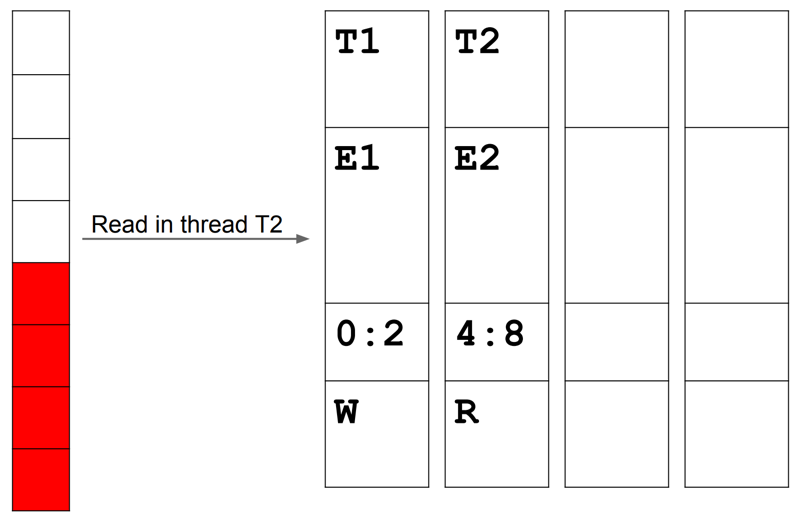

# Санитайзеры

## ASan

Address sanitizer. Ловит ошибки связанные с адресацией:
* use after free
* heap buffer overflow
* stack buffer overflow
* use after scope
* memory leak
* ...

Сильно снижает производительность (~2x). Проверяет, что все обращения к памяти валидные.

Для этого вводится ShadowMemory -- область памяти, хранящая информацию про основную память.

Теперь с помощью ShadowMemory мы можем понимать состояние памяти по конкретному адресу.
Если попадаем в красную зону, значит обращение к памяти было невалидным. 

Добавим свой аллокатор, который будет:
* выравнивать все до 8 байт
* добавлять красную буфферную зону вокруг каждого выделения памяти:

  
Памяти, показанной выше будет соответствовать shadow bytes : `0xff`, `0x05`, `0xff`.

Shadow для адреса `x` будет храниться по адресу `x` / 8. 

Мы не можем использовать нулевые адреса, поэтому добавим оффсет.

Shadow для адреса `x` будет храниться по адресу `x` / 8 + offset.

Тут можно посмотреть подробнее: https://godbolt.org/z/dsP1e7Mx3

## TSan
Thread Sanitizer. Ловит data races.
Сильно снижает производительность (~5x-15x по времени, ~5x-10x по памяти).
Внутри тоже использует понятие ShadowMemory, но она устроена по-другому.
Хотим уметь сохранять информацию об обращениях к памяти.
На каждый блок 8 байт выделяется 4 Shadow cell размером по 8 байт.
Shadow cell хранит в себе:
* TID -- thread id (16b)
* Scalar Clock (42b)
* Position/Size (8b)
* IsWrite (1b)

На каждое обращение в памяти:
* Увеличивается скалярное время,
* Строится Shadow cell
* Если есть свободное место, то она помещается туда. Если нет, то вставляется вместо рандомной (обязательно happened_before). 

Отношение happen-before задается с помощью мьютекса/семафора/атомиков ...

При вставке проверяется, что не возникает data race-ов. Пример:

Пример, чтобы поглядеть в asm: https://godbolt.org/z/f4Y3YfjTb
## UBSan
Вставляет проверки во время компиляции и ловит некоторые ub во время исполнения (не все конечно, а простые).

Пример: https://godbolt.org/z/3G66Ydb9o

Проверяет указатель x на на валидность, 
