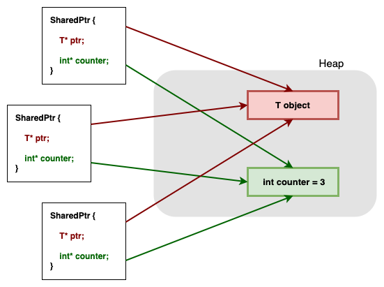
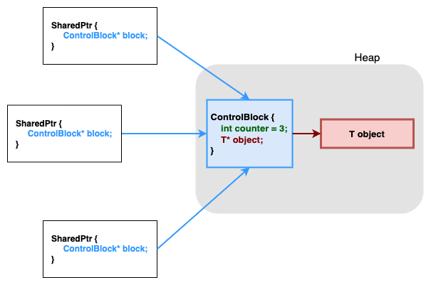
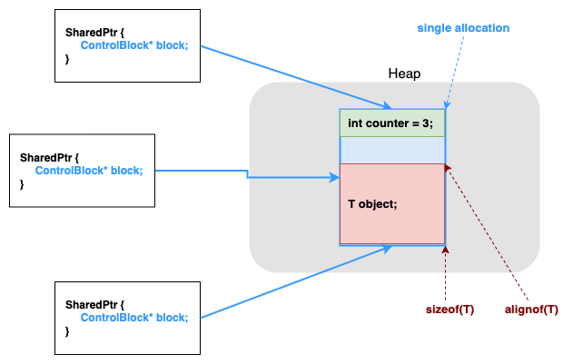
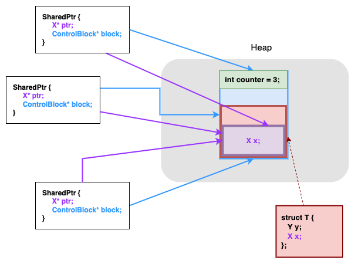
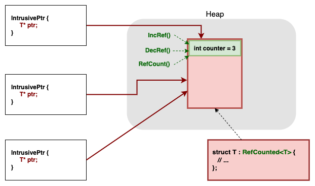

# Как решать `smart-ptrs`?

- [Как решать `smart-ptrs`?](#как-решать-smart-ptrs)
  - [Общие моменты](#общие-моменты)
  - [`UniquePtr`](#uniqueptr)
  - [`SharedPtr`](#sharedptr)
    - [Первый подход](#первый-подход)
    - [`MakeShared`. Второй вариант контрольного блока](#makeshared-второй-вариант-контрольного-блока)
    - [Aliasing constructor. Почему нужно все-таки два указателя](#aliasing-constructor-почему-нужно-все-таки-два-указателя)
    - [Upcasts](#upcasts)
    - [Советы по дизайну](#советы-по-дизайну)
  - [`WeakPtr`](#weakptr)
  - [`SharedFromThis`](#sharedfromthis)
  - [`IntrusivePtr`](#intrusiveptr)

## Общие моменты

1) Обязательно запускайте все под санитайзерами, в том числе Leak Sanitizer (который ловит утечки памяти). На MacOS LSAN может не работать на компиляторе по умолчанию (Apple Clang), рекомендуется поставить homebrew clang (`brew install llvm`) и собирать им. Проверьте перед началом работы, что ваша сборка находит очевидные утечки. Пишите в чат, если что-то не получается настроить.

2) Вы можете найти реализацию умных указателей во многих источниках, и хорошо, если вы сможете в них *разобраться*. Однако слепое копирование без понимания всегда заметно, и мы обязательно будем выявлять такие случаи :)

## `UniquePtr`

Самый простой умный указатель - `std::unique_ptr`. Все, что он делает - каким-то образом принимает и сохраняет в себе указатель на аллоцированную память, а в деструкторе удаляет ее. Таким образом, `unique_ptr` осуществляет *владение* над объектом, поэтому логично, что у него нет конструктора копирования и копирующего оператора присваивания.

Простейшую реализацию `unique_ptr` вы наверняка писали на 1 курсе, наша будет отличаться в нескольких моментах. Во-первых, указатель может быть не только на единичный элемент, но и на целый массив, поэтому существует также реализация `unique_ptr<T[]>`. Почему для нее нужна отдельная специализация? Что в ней будет отличаться по сравнению с основной?

Во-вторых, объект, которым владеет умный указатель, может требовать более сложной семантики удаления, чем `operator delete` (какие можно привести примеры?), поэтому у `unique_ptr` есть второй шаблонный параметр `Deleter` - функтор, который нужно позвать в деструкторе указателя. Важно знать, что вообще говоря звать его на `nullptr` некорректно (хотя `delete nullptr;` и безопасен). У `std::unique_ptr` есть дефолтный делитер, вам также нужно его реализовать вместо `Slug`.Как эффективно хранить делитер? (можно посмотреть на тесты на размер `UniquePtr`).

Третье - бывают также указатели `void*`, и их может быть удобно захватывать в `UniquePtr`. Зачем такое может быть нужно? Где возникнут проблемы с `UniquePtr<void>` в обычной реализации?

Дополнительно можно обсудить:
* Почему в `std::default_delete<T>` можно встретить `static_assert(sizeof(T) > 0)` и `static_assert(!is_void_v<T>)`?
* В какие методы `UniquePtr` стоит добавить `noexcept` и почему? Как работает `std::vector<std::unique_ptr>`?
* Рассказать, что можно в качестве делитера хранить ссылку. К каким эффектам это приводит? Можно посмотреть прошлогодние тесты.

## `SharedPtr`

### Первый подход

Семантика `shared_ptr` всем известна - этот класс кроме указателя на объект хранит также счетчик ссылок на него и удаляет всех, когда счетчик обнуляется. Как реализовать такое поведение в простейшем виде с помощью поля `int*`? Что будет происходить в конструкторе копирования, в конструкторе перемещения?

.

Какой размер у такого `SharedPtr`? Как добиться `sizeof(SharedPtr<T>) == sizeof(void*)` с помощью контрольного блока?



### `MakeShared`. Второй вариант контрольного блока

Какие есть способы "заполнить" `SharedPtr`? Глобально три:

1) Передать сырой указатель в конструкторе либо в `Reset`
2) Скопировать из другого `SharedPtr`, при этом счетчик ссылок должен увеличиться
3) Создать объект с нуля и сразу получить на него `SharedPtr` с помощью `MakeShared`.

Рассмотрим третий способ подробнее. Сколько будет выполнено аллокаций в наивной реализации `MakeShared<T>` через уже написанный контрольный блок? Ответ: 2 (без учета аллокаций внутри создаваемого объекта типа `T`,на что повлиять нельзя).

Попробуем добиться одной аллокации. Ключевая предпосылка - создаваемый объект типа `T` будет удаляться самим `SharedPtr` и никем больше.

Выделим память под объект и под счетчик *одной аллокацией*. Вопросы, которые здесь требуют ответа:

* Как определить нужный размер и выравнивание памяти под объект и под блок?
* Как разделить выделение памяти и вызов конструктора на этой памяти?
* Как правильно передать аргументы в конструктор типа `T` через `MakeShared<T>` и конструктор блока?
* Как отличать блок первого типа (с указателем и счетчиком) от блока второго типа (с объектом и счетчиком)?

Ответы на эти вопросы (кроме, может быть, последнего) - на прошлых лекциях и семинарах :)

Теперь можно вместе ответить на вопрос, почему в `std::shared_ptr` нет метода `release`.



### Aliasing constructor. Почему нужно все-таки два указателя

Рассмотрим [ситуацию](aliasing-ctor.cpp) - имеется структура, доступная через `shared_ptr`, и нужно передать в функцию указатель на одно из ее полей. Функция не знает, что передаваемый объект является полем некой структуры, при этом ее аргумент не должен удалиться до ее окончания. Как обеспечить тут корректную работу с памятью?

Чтобы в данном примере сохранить корректность и избежать аллокаций, нужна поддержка со стороны `shared_ptr` - а именно, нужно уметь разделять, *какой памятью объект владеет* и *на какую указывает*. Что есть что в нашем примере?

Для поддержки такой семантики существует aliasing constructor
```cpp
template <typename Y>
SharedPtr(const SharedPtr<Y>& other, T* ptr);
```

Что такое `Y` и `T` в нашем примере?



Еще вопросы для обсуждения:

* Куда сохранить `ptr`? Почему плохо держать его в контрольном блоке? (А что если понадобится создать умные указатели на несколько разных полей?)

* Как удалять объект из указателя, созданного через aliasing - ведь мы ,больше не знаем тип исходного объекта? Тут можно посмотреть [пример type erasure](type-erasure.cpp) и поговорить про самоудаление объектов и почему это корректно.

### Upcasts

Что если в `UniquePtr<Base>` передать указатель `Derived*`? В каком случае память будет корректно удалена, а в каком нет? А если мы говорим о `SharedPtr<Base>`?

На самом деле, `SharedPtr<T>` имеет [больше](https://en.cppreference.com/w/cpp/memory/shared_ptr/shared_ptr) конструкторов, чем представлено в заготовке - в основном за счет различных шаблонных версий. Зачем они нужны? Это можно рассматривать как еще один случай aliasing ctor - приняв указатель другого типа `Y`, можно создать контрольный блок этого типа, чтобы затем корректно удалить `Y*`.
```cpp
template<typename T>
class SharedPtr {

    template<typename Y>
    SharedPtr(Y* ptr) {
        // control block of Y, observing T*
    }

    // Do we need this, having upper ctor?
    SharedPtr(T* ptr) {
        // control block of T, observing T*
    }

    // This is not actually `copy ctor`, because it's templated
    template <typename Y>
    SharedPtr(const SharedPtr<Y>& other) {
        // ???
    }

    // Copy ctor.
    // Does the same as previous, but can't be removed -
    // - otherwise compiler may generate default copy ctor
    // and the world will crash
    SharedPtr(const SharedPtr& other) { // T is meant
        // ???
    }
};

```

Если есть шаблонные версии конструкторов, то зачем нужны отдельные реализации для типа `T`, можно ли от них избавиться? Смотря от каких - например, конструктор от `T*` удалить можно, но нельзя удалять конструкторы копирования и перемещения и соответствующие операторы - так как при их отсутствии компилятор может сгенерировать свои, в которых, конечно, счетчик ссылок не увеличится. Это можно долго отлаживать, помните правило пяти!

Чтобы в таких шаблонных конструкторах иметь доступ к приватным полям объекта в аргументе, нужно добавить `friend`-декларацию для `SharedPtr` всех типов:

```cpp
template <typename Y>
friend class SharedPtr;
```

### Советы по дизайну

Мы имеем два варианта контрольного блока (с указателем и с объектом), как избежать бранчинга в основном классе? Используем наследование и полиморфизм: создадим базовый класс, и два наследника для двух типов блоков. Что нужно от каждого блока?

* Инкрементировать счетчик ссылок
* Декрементировать счетчик ссылок. (Что происходит при достижении нуля?)

Отличается ли эта логика у контрольных блоков? Отличие только в семантике удаления. Давайте эту семантику и переопределим в классах-наследниках.

Что делает при обнулении ссылок первый блок и второй блок? А как должен удаляться сам блок? Как это сделать проще всего?

Постарайтесь нигде в коде класса `SharedPtr` не обращаться к полям контрольного блока напрямую. Вместо этого создайте необходимые методы в контрольном блоке, и вызывайте снаружи только их.

## `WeakPtr`

Рассматриваем простейший пример с созданием циклических ссылок между `SharedPtr`-ами.

```cpp
#include <memory>

struct S {
    std::shared_ptr<S> my_friend;
};

int main() {
    auto p1 = std::make_shared<S>();
    auto p2 = std::make_shared<S>();

    p1->my_friend = p2;
    p2->my_friend = p1;

    // leak!
}
```

В чем проблема? Почему бы не заменить один из указателей на сырой?

Основные моменты из семантики `WeakPtr`:

* Не препятствует удалению объекта, на который смотрит. Как и сырой указатель.
* Позволяет узнавать, удален ли уже объект. Поэтому лучше сырого указателя.
* Можно получить только из `SharedPtr` (см. конструкторы)

Пример использования есть [тут](../01-memory/02-weak-ptr.cpp).

Как `WeakPtr` может узнавать, что объект уже удален? Так как он может быть создан только из `SharedPtr`, можно дать ему доступ к контрольному блоку, в котором есть счетчик ссылок.

Однако теперь нужно гарантировать, что сам контрольный блок не удалится при удалении объекта, которым владеют указатели - то есть, *лайфтаймы контрольного блока и объекта будут разными*.

Теперь нужно поддерживать два счетчика - для "сильных" ссылок, которые соответствуют `SharedPtr`, и для "слабых" ссылок из `WeakPtr`-ов. Что должно происходить при обнулении каждого счетчика?

Общее:
* Точную семантику методов уточняйте на cppreference.
* `WeakPtr` также имеет умеет быть aliasing.
* Как и в `SharedPtr`, постарайтесь не обращаться к полям контрольного блока напрямую. Заведите методы.

## `SharedFromThis`

Сначала стоит обсудить, как правильно и как неправильно копировать `SharedPtr` (есть в [примере](esft.cpp)). А что делать, если в какой-то точке программы у вас нет `SharedPtr<T>`, есть только `T*`, и нужно получить корректный `SharedPtr<T>`? Можем ли мы научить сам объект типа `T` увеличивать счетчик ссылок на себя?

Подобный интерфейс предоставляет `std::enable_shared_from_this<T>` ([пример использования](esft.cpp)). Тип `T`, наследуясь от `std::enable_shared_from_this<T>`, получает методы `shared_from_this()` и `weak_from_this()`, которые позволяют получить корректные `std::shared_ptr<T>` и `std::weak_ptr<T>` соответственно. При этом требуется, чтобы объект на момент их вызова находился во владении какого-либо `std::shared_ptr`.

Как такое можно имплементировать? Очевидно, при вызове `shared_from_this()` должно происходить увеличение счетчика strong-ссылок в контрольном блоке.

Откуда у объекта доступ к контрольному блоку `shared_ptr`-а, который им владеет? Чтобы такой доступ был, будем в классе `ESFT<T>` хранить поле `WeakPtr<T> weak_this`  - умный указатель на себя.

Как будет инициализироваться `weak_this`? Помним, что `WeakPtr` можно получить только из `SharedPtr`. Поэтому нужно научиться понимать при конструировании `SharedPtr<T>`, что тип `T` поддерживает `ESFT`-семантику,  и в таком случае заполнять `weak_this`.

Это делается с помощью специального трюка: создается нешаблонный базовый класс `ESFTBase`, от которого наследуется `ESFT<T>`. Используя трейт `std::is_convertible_v<A*, B*>` можно проверить, что указатель `T*` конвертируем в `ESFTBase*` - и если это так, то у типа `T` должно быть поле `weak_this`, которое нужно проинициализировать из созданного только что `SharedPtr`. Эта проверка должна делаться в compile-time, поэтому нужно использовать `if constexpr` - чтобы выражение под ним компилировалось тогда и только тогда, когда условие верно.

Можно заметить, что в типе `T`, поддерживающем `ESFT`, появляется некоторая цикличность - он хранит полем `WeakPtr<T>` на контрольный блок, который может содержать внутри сам объект, если он был создан через `MakeShared`. Попробуйте самостоятельно разорвать этот цикл :)

Также можно обсудить:

* Зачем нужна такая сложная схема с нешаблонным `ESFTBase` и проверкой через `std::is_convertible_v<T*, ESFTBase*>`? Почему не `std::is_base_of_v<T, ESFT<T>>`? Подсказка - в начале файла с тестами `ESFT`.

* Что делать, если тип `T` имеет свое поле под названием `weak_this`? Чтобы совсем корректно обработать такое, нужно вызывать присваивание `ptr->weak_this = *this` у `ptr` типа `ESFT<Y>` (`Y` не обязательно имеет тип `T`!). Здесь тоже шаблонная магия:

```cpp
template <typename Y>
void InitWeakThis(EnableSharedFromThis<Y>* e) {
    e->weak_this = *this;
}
```

С таким кодом все выведется как нужно.

## `IntrusivePtr`

Последняя и сравнительно легкая подзадача - реализация интрузивного умного указателя. Вы уже встречались с понятием *интрузивности*, когда реализовывали список, который является не контейнером для объектов, а лишь точкой их сбора.

Здесь та же мотивация - можно оптимальнее решать задачу множественного владения объектом с подсчетом ссылок (то, что делает `SharedPtr`), если перенести этот подсчет ссылок в сам объект. Взаимодействие со встроенным (embedded) счетчиком ссылок осуществляется через методы класса `T` -  `IncRef()`, `DecRef()` и `RefCount()`. Важно, что `DecRef()` обеспечивает самостоятельное удаление объекта при достижении счетчиком нуля.

Какие плюсы у такого подхода?
* Во-первых, так как счетчик ссылок встроен в объект, он аллоцируется вместе с ним, и нет необходимости в построении сложной конструкции с контрольным блоком, как в `SharedPtr`.
* Во-вторых, так как счетчик ссылок всегда с объектом, `IntrusivePtr<T>` можно в любой момент построить из `T*`.
* Третья причина - создавая `SharedPtr<T>`, вы всегда получаете "в нагрузку" счетчик слабых ссылок для `WeakPtr<T>` и дополнительный код, связанный со слабым указателем. При этом `WeakPtr<T>` нужен далеко не всегда - в `IntrusivePtr<T>` же такой семантики нет совсем, здесь он оптимальнее.



Реализация довольно очевидна, в условии уже введены все необходимые абстракции. В частности, обратите внимание на определение `SimpleRefCounted<T>` - на что оно похоже?
